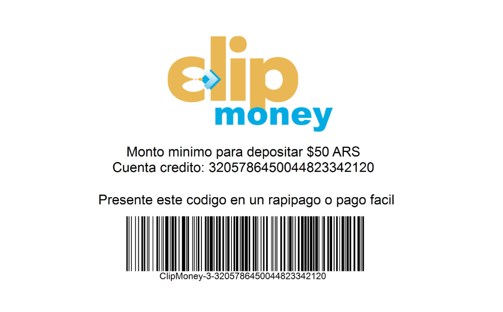

# Clip Money


## Desarrollo

### General

Haciendo un get a `./api/Account/` se obtienen las cuentas del usuario logeado.
Se devuelve un JSON con un array de objetos de cuentas.

Ejemplo:

```json
{
    "Success": 1,
    "Message": "Exito - cuentas del usuario obtenidas exitosamente",
    "Data": [
        {
            "AccountId": 1,
            "TypeAccount": {
                "AccountTypeId": 1,
                "AccountTypeName": "CORRIENTE"
            },
            "Currency": {
                "CurrencyId": 1,
                "CurrencyName": "PESO ARGENTINO",
                "Fee": 1.0,
                "SalePrice": 70.0000,
                "PurchasePrice": 60.0000
            },
            "User": null,
            "CVU": "4879413218432184163518",
            "Balance": 6742.0500,
            "Alias": "PRUEBA1.PRUEBA2",
            "OpeningDate": "2020-12-19T00:00:00"
        },
        {
            "AccountId": 2,
            "TypeAccount": {
                "AccountTypeId": 1,
                "AccountTypeName": "CORRIENTE"
            },
            "Currency": {
                "CurrencyId": 1,
                "CurrencyName": "PESO ARGENTINO",
                "Fee": 1.0,
                "SalePrice": 70.0000,
                "PurchasePrice": 60.0000
            },
            "User": null,
            "CVU": "8831892375712317645923",
            "Balance": 253257.9500,
            "Alias": "PRUEBA3.PRUEBA4",
            "OpeningDate": "2020-12-19T00:00:00"
        }
    ]
}
```

Haciendo un get a `./api/Transactions/` se obtienen las 10 ultimas transacciones del usuario, actualmente solo muestra depositos y transferencias

Ejemplo:
```json
{
    "Success": 1,
    "Message": "Exito - transactiones obtenidas correctamente",
    "Data": [
        {
            "TransactionType": "DEPOSITO",
            "DateTime": "2020-12-27T20:31:00",
            "Account": "8831892375712317645923",
            "Amount": 35000.0000,
            "Concept": "",
            "VoucherNumber": 2
        },
        {
            "TransactionType": "TRANSFERENCIA",
            "DateTime": "2020-12-27T20:22:00",
            "Account": "4879413218432184163518",
            "Amount": 14657.9500,
            "Concept": "PAGO SERVICIO",
            "VoucherNumber": 4
        },
        {
            "TransactionType": "TRANSFERENCIA",
            "DateTime": "2020-12-27T20:21:00",
            "Account": "8831892375712317645923",
            "Amount": 10000.0000,
            "Concept": "PRESTAMO",
            "VoucherNumber": 3
        },
        {
            "TransactionType": "TRANSFERENCIA",
            "DateTime": "2020-12-27T20:19:00",
            "Account": "8831892375712317645923",
            "Amount": 1500.0000,
            "Concept": "PAGO CUOTA",
            "VoucherNumber": 2
        },
        {
            "TransactionType": "DEPOSITO",
            "DateTime": "2020-12-27T16:52:00",
            "Account": "8831892375712317645923",
            "Amount": 15000.0000,
            "Concept": "",
            "VoucherNumber": 1
        },
        {
            "TransactionType": "TRANSFERENCIA",
            "DateTime": "2020-12-20T23:20:00",
            "Account": "4879413218432184163518",
            "Amount": 100.0000,
            "Concept": "Prueba",
            "VoucherNumber": 1
        }
    ]
}
```

Haciendo un post a ´http://localhost:49220/api/Account/Alias´ enviado un json como el siguiente se actualiza el alias de la cuenta especificada
```json
{
    "AccountId": 3,
    "Alias": "NUEVO.ALIAS"
}
```

#### Usuario


Haciendo un get a `./api/User` se obtienen los datos del usuario logeado

Ejemplo:
```json
{
    "Success": 1,
    "Message": "Exito - se obtuvo los datos del usuario",
    "Data": {
        "Cuil": "81711677771",
        "Name": "david",
        "Surname": "Alvarez",
        "Email": "contacto@gmail.com",
        "PhoneNumber": "35132142123"
    }
}
```

Haciendo un put a `./api/User` se actualizan los datos del usuario enviando un json con el siguiente formato, ademas como respuesta se obtienen los nuevos datos del usuario.
```json 
{
    "PhoneNumber": "35132142123",
    "Email": "contacto@gmail.com"
}
```
En caso de haber un campo con formato incorrecto se devolvera un JSON con el siguiente formato.
```json
{
    "Success": 0,
    "Message": "Error, campos invalidos",
    "Data": {
        "PhoneNumber": "Numero de telefono incorrecto",
        "Email": "El email ingresado no es valido"
    }
}
```


### Deposito

#### Efectivo

Haciendo un get a './api/Deposit/Cash?cvu=NumeroDeCvu' se obtiene un PDF con un codigo de barras el cual esta compuesto por el numero de cvu y el id de usuario, no olvidarse de mandar el token en el header ya que hace una validacion de que el cvu sea del usuario logeado.

Imagen del pdf:




#### Tarjeta

Haciendo un get a `./api/Deposit/CreditCard?number=NumeroDeTarjeta` se obtiene un json diciendo si la tarjeta de credito es valida y de que entidad financiera es.

No es necesario pasar el numero completo de la tarjeta para obtener la entidad financiera

Ejemplo llamando a
`http://localhost:49220/api/Deposit/CreditCard?number=4111111111111111`
```json
{
    "Success": 1,
    "Message": "Exito - validacion de la tarjeta realizada",
    "Data": {
        "IsValid": false,
        "Brand": "Visa"
    }
}
```

Para hacer un deposito con tarjeta hacer un post a `./api/Deposit/CreditCard` con un JSON con el formato:

```json
{
    "FullName": "Cristian Almada",
    "ExpirationDate": "06/22",
    "CreditCardNumber": "4111111111111111",
    "SecurityNumber": 422,
    "DocumentNumber": 11222333,
    "Amount": 15000,
    "DebitAccountId": 2
}
```

En caso de que alguno de los campos sea incorrecto se devolvera un json con el siguiente formato, informando a cuales campos hay errores y informacion sobre el error

```json
{
    "Success": 0,
    "Message": "Error, campos invalidos",
    "Data": {
        "FullName": "El nombre tiene que ser como minimo de 5 caracteres y menor que 30",
        "ExpirationDate": "La fecha de expiracion debe ser igual a 5",
        "CreditCardNumber": "La longitud del numero de la tarjeta debe ser igual a 16",
        "SecurityNumber": "El numero de seguridad debe ser igual a 3",
        "DocumentNumber": "Numero de documento incorrecto",
        "Amount": "El monto minimo a depositar es 200 y como maximo puede ser 50000",
        "DebitAccountId": "El id de la cuenta a depositar tiene que ser positivo"
    }
}
```

#### Transferencias

Para obtener informacion basica de cuenta de destino, hacer get a `./api/Transfer?cvu=numeroDeCvu`
Ejemplo: ./api/Transfer?cvu=4879413218432184163518
```json
{
    "Success": 1,
    "Message": "Exito - cuenta obtenida",
    "Data": {
        "CVU": "4879413218432184163518",
        "AccountId": 1,
        "Owner": {
            "Name": "David",
            "Surname": "Alvarez",
            "Cuil": "81711677771"
        }
    }
}
```

Para realizar una transferencia hacer un post a `./api/Transfer` con un json con el formato:
```json
{
    "DebitAccountId": 1,
    "Amount": 100,
    "CreditAccountId": 2,
    "Concept": "Prueba",
    "DestinationReference": "Prueba",
    "EmailNotificacion": "contacto@gmail.com"
}
```

#### Retiro

Para realizar un retiro realizar un post a `./api/Withdraw` mandando en el body un json con el formato:
```json
{
    "AccountId": 3,
    "Amount": 100,
    "Uncovered": false
}
```
Si el valor de "Uncovered" es true entonces se va a permitir retirar hasta el 10% del saldo actual de la cuenta